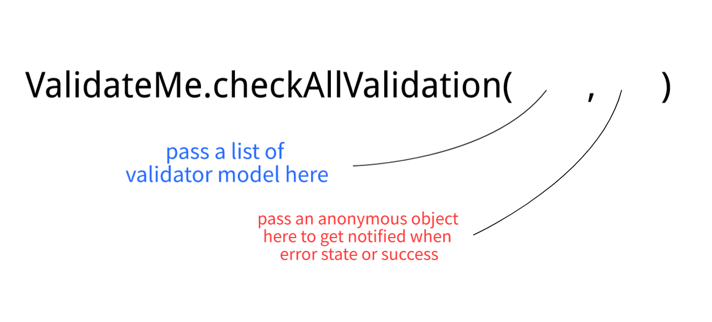
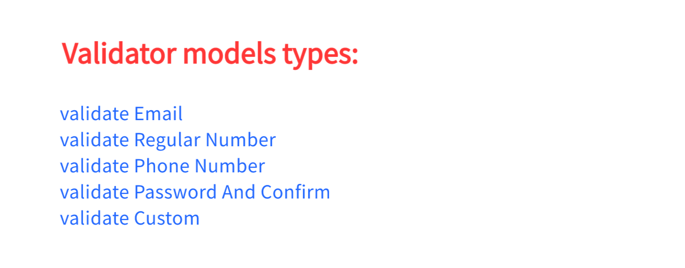

# Validate-Me
An android lib to test validations by easy way (support both [java, kotlin])   
Validate-Me well tested using jUnit.

<p align="center">
	
</p>

## Setup:   

**Step 1.** Add it in your root build.gradle at the end of repositories:

``` groovy
allprojects {
		repositories {
			...
			maven { url 'https://jitpack.io' }
		}
	}
```

**Step 2.** Add the dependency
 
 **Hint :**  
 replace Tag with latest verion here
[](https://jitpack.io/#Eng-AhmedShehata/Validate-Me)   

``` groovy
dependencies {
	  implementation 'com.github.Eng-AhmedShehata:Validate-Me:Tag'
	}
```

---

## How to use it:   
<p align="left">
	
</p>   

<p align="left">
	
</p>   

In kotlin:   
``` kotlin
ValidateME.checkAllValidation(
            listOf(
                ValidateME.validateEmail("ahsdw@yahoo.com"),
                ValidateME.validateRegularNumber(5, 0, 10, 1),
                ValidateME.validatePhoneNumber("01064261149", 11),
                ValidateME.validatePasswordAndConfirm("01064261149", "01064261149", 4),
                ValidateME.validatePasswordAndConfirm("01064261149", "0101414", 4),
                ValidateME.validateEmail("ahsdw@yah22o.com"),
                /**
                 *   add more validation types here
                 */
            ),
            onValidationResult = object : ValidateME.OnValidationResult {
                override fun onSuccess() {
                    // so, continue your flow after a successfully validation

                }

                override fun onError(validateErrorType: ValidateErrorType?, validatePosition: Int) {
                    // handle your error here after validation has failed
                    val value = when (validateErrorType) {
                        ValidateErrorType.PhoneNumber -> "phone"
                        ValidateErrorType.RegularNumber -> "num"
                        ValidateErrorType.Email -> "email"
                        ValidateErrorType.TextNumber -> "text"
                        ValidateErrorType.Password -> "pass"
                        ValidateErrorType.PasswordConfirm -> "confirm"
                        ValidateErrorType.Custom -> "custom"
                        null -> ""
                    }
                    
                }
            }
        )

```

In java:   
``` java
List<ValidateModel> validateModels = new ArrayList<>();

        validateModels.add(ValidateME.validateEmail("asdsadsadsad"));
        validateModels.add(ValidateME.validatePassword("1241", 5));
        validateModels.add(ValidateME.validatePhoneNumber("1071927410", 12));
        /*
         *   add more validation types here
         */

        // So now check all fields
        ValidateME.checkAllValidation(validateModels,
                new ValidateME.OnValidationResult() {
                    @Override
                    public void onSuccess() {
                        // so, continue your flow after a successfully validation
                    }

                    @Override
                    public void onError(@Nullable ValidateErrorType validateErrorType, int validatePosition) {
                        // handle your error here after validation has failed
                        switch (validateErrorType) {
                            case Email :
                                //TODO
                                break;
                            case PhoneNumber :
                                //TODO
                                break;
                            /*
                             * And so on
                             */

                        }
                    }
                }
        );
```

### Add your custom validation: (2 ways)   
### Way no.1:   
Use ->  ValidateME.validateCustom(yourRegexPattern, yourText)   
``` kotlin
ValidateME.validateCustom("[a-zA-Z0-9]{2}", "m2")
```
yourRegexPattern: Pass your [Regex Pattern](https://www.vogella.com/tutorials/JavaRegularExpressions/article.html).    
yourText: Pass your text the you wanna validate it.   

Then:  
Pass the ValidateME.validateCustom(yourRegexPattern, yourText) to validtor class like this   

``` kotlin
ValidateME.checkAllValidation(
            listOf(
                ValidateME.validateEmail("ahsdw@yahoo.com"),
                ValidateME.validateCustom("[a-zA-Z0-9]{2}", "m2")
                /**
                 *   add more validation types here
                 */
            ),
            onValidationResult = object : ValidateME.OnValidationResult {
                override fun onSuccess() {
                    // so, continue your flow after a successfully validation

                }

                override fun onError(validateErrorType: ValidateErrorType?, validatePosition: Int) {
                    // handle your error here after validation has failed
                    val value = when (validateErrorType) {
                        ValidateErrorType.Custom -> "Custom error"
			// add other types here
                        
                    }
                    
                }
            }
        )
```


### Way no.2: (More customization)   

First:   
Make your own validtor method and make it return a ValidateModel corresponding to your bussiness logic
for example if I want to make a validator method to check if some field check or not so:   

``` java 
private ValidateModel checkIfChecked(boolean isChecked) {
        if (isChecked) return new ValidateModel(true, null);
        else return new ValidateModel(false, Custom);
    }

```

Then:   
Pass it to to validtor class.

Finally:   
You can handle error message if field not valid like this.   
``` java
List<ValidateModel> validateModels = new ArrayList<>();
	validateModels.add(checkIfChecked(radioButton.isChecked()));
        validateModels.add(ValidateME.validateEmail("asdsadsadsad"));
        validateModels.add(ValidateME.validatePhoneNumber("1071927410", 12));
        /*
         *   add more validation types here
         */

        // So now check all fields
        ValidateME.checkAllValidation(validateModels,
                new ValidateME.OnValidationResult() {
                    @Override
                    public void onSuccess() {
                        // so, continue your flow after a successfully validation
                    }

                    @Override
                    public void onError(@Nullable ValidateErrorType validateErrorType, int validatePosition) {
                        // handle your error here after validation has failed
                        switch (validateErrorType) {
                            case Custom :                          
                            /*
                             * And so on
                             */

                        }
                    }
                }
        );

```
### Handling Error after validation failed:   
You need to override onError Method and check validateErrorType to handle error.   

In java:   
``` java
    @Override
    public void onError(@Nullable ValidateErrorType validateErrorType, int validatePosition) {
	// handle your error here after validation has failed
	switch (validateErrorType) {
	    case RegularNumber:
		break;
	    case Email:
		//TODO
		break;
	    case PhoneNumber:
		//TODO
		break;
	    case TextNumber:
		break;
	    case Password:
		break;
	    case PasswordConfirm:
		break;
	    case Custom:
		break;
	}
    }
```

In kotlin:   
``` kotlin
override fun onError(validateErrorType: ValidateErrorType?, validatePosition: Int) {
	    // handle your error here after validation has failed
	    val value = when (validateErrorType) {
		ValidateErrorType.PhoneNumber -> "phone"
		ValidateErrorType.RegularNumber -> "num"
		ValidateErrorType.Email -> "email"
		ValidateErrorType.TextNumber -> "text"
		ValidateErrorType.Password -> "pass"
		ValidateErrorType.PasswordConfirm -> "confirm"
		ValidateErrorType.Custom -> "custom"
		
		showToast(value)
	    }
	}

```
### Very important tip:   
If you validate 2 things or more than two of the same type you need to check the position of it in the list like this:   

``` java
List<ValidateModel> validateModels = new ArrayList<>();
	// here you validate 2 elements of the same type.
        validateModels.add(ValidateME.validateEmail("ahmed@yaooo"));
        validateModels.add(ValidateME.validateEmail("mohamed@mail.com"));
        /*
         *   add more validation types here
         */

        // So now check all fields
        ValidateME.checkAllValidation(validateModels,
                new ValidateME.OnValidationResult() {
                    @Override
                    public void onSuccess() {
                        // so, continue your flow after a successfully validation
                    }

                    @Override
                    public void onError(@Nullable ValidateErrorType validateErrorType, int validatePosition) {
                        // handle your error here after validation has failed
                        switch (validateErrorType) {
                            case Email :  
			    if (validatePosition == 0) {
			    	showToast("First email not valid");
			    } else if (validatePosition == 1) {
			    	showToast("Second email not valid");
			    }
			    break; 
			    /*
			    * Continue handling other validations error if found
			    */

                        }
                    }
                }
        );

```

### Proguard:   
``` pro
-keep class com.ashehata.mylibrary.ValidateModel
-keep class com.ashehata.mylibrary.ValidateErrorType
```

